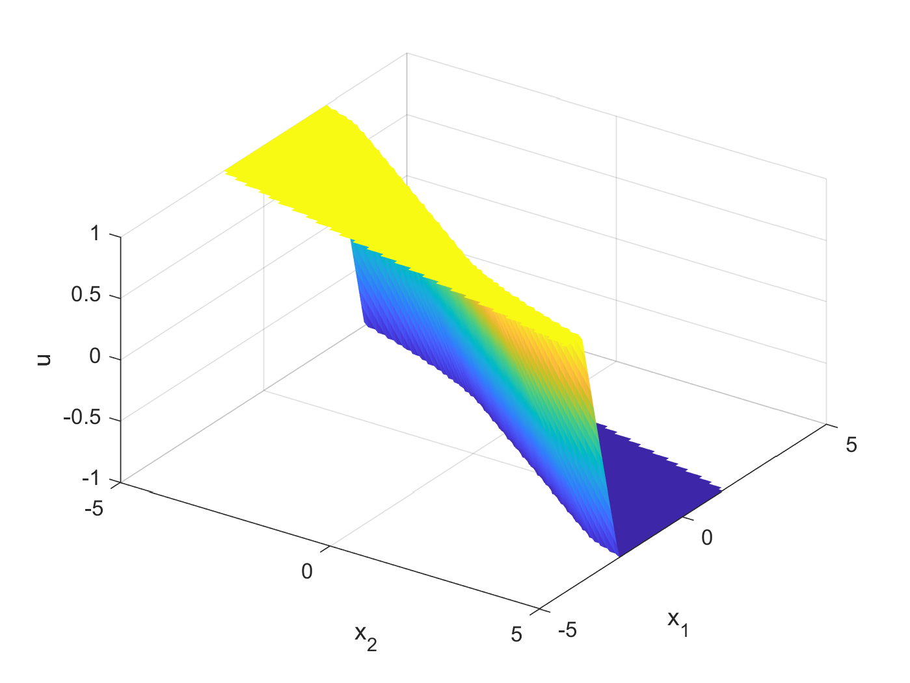

# Differentiable Predictive Control 
Prototype code for the paper: https://arxiv.org/abs/2004.11184

## Method

  
*Conceptual methodology.*

  
*Structural equivalence of DPC architecture with MPC constraints.*

  
*Closed-loop trajectories of learned constrained neural control policy using DPC.*

  
*Learned DPC policy.*

  
*Computed explicit MPC policy.*

  
*Adaptive DPC of unknown linear system subject to disturbances.*

## Dependencies: Python Libraries
See environment.yml to reproduce the Conda environment for running experiment 2. 
For experiment 1 install Neuromancer package with dependencies: 
[double_integrator_DPC](https://github.com/pnnl/neuromancer/).
For GPU capabilities  install gpu version of Pytorch. 

## Files
### Models
- GroundTruthSSM.py: Ground truth system model

### Control Example 1 
- Double integrator example using the Neuromancer package:
[double_integrator_DPC](https://github.com/pnnl/neuromancer/compare/double_integrator_DPC)

### Control Example 2
- DeepMPC_sysID_ctrl_sec_2_4.py - policy optimization with ground truth model Section 2.4
- DeepMPC_sysID_ctrl_sec_2_5.py - simultaneous system ID and policy optimization Section 2.5
- DeepMPC_sysID_ctrl_sec_3_7 	- computational aspects and scalability analysis results for Section 3.7

### SystemID
- results_and_analysis.py: Generate tables and figures related to system identification experiments
- sysid_exp.py: System ID experiments described in paper
- system_id.py: Class definitions for RNN, GRU, LIN, and SSM models, optimization code for system identification training

### Control Benchmarks
- LQR
- LQI
- nominal, stochastic, and robust MPC - formulations defined in the paper: https://ieeexplore.ieee.org/document/6760908

## Cite as
